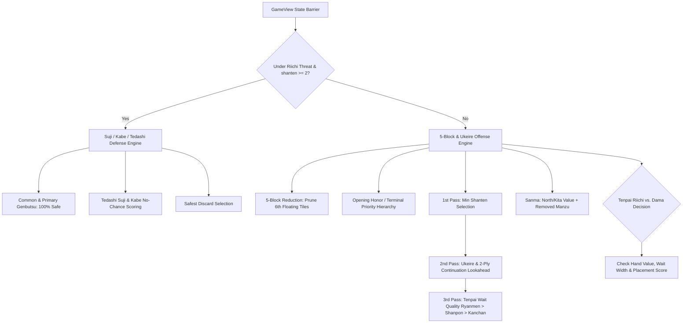
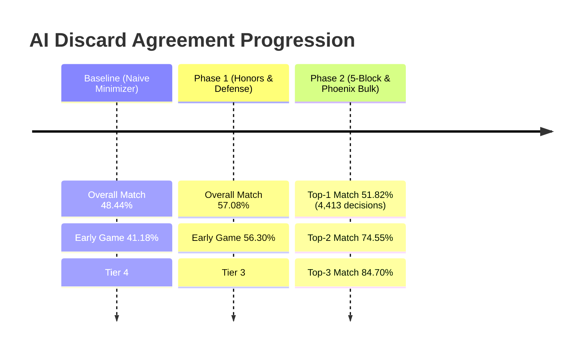

# 🀄 Mahjong AI Cleverness Benchmark Report

**Evaluation Target**: `GreedyAI` (Pure Python Native Rule-Based Engine)  
**Dataset**: Bundled Tenhou Phoenix replays (鳳凰卓, top 0.1% human & master bots)  
**Total Match Sample**: 10 four-player games (4,413 discard decisions) plus 5 three-player games (1,109 discard decisions)  
**Date**: 2026-08-30  

---

## 1. Executive Summary

| Metric | Result | Benchmark Tier |
| :--- | :--- | :--- |
| **Top-1 Discard Match Rate** | **51.82%** (2,287 / 4,413) | **Tier 4 / strong intermediate** |
| **Top-2 Soft Agreement Rate** | **74.55%** (3,290 / 4,413) | **Good candidate-set alignment** |
| **Top-3 Candidate Inclusion** | **84.70%** | **Robust discard candidate pool** |
| **1-Shanten Top-1 Match** | **74.83%** (Top-2: **90.73%**) | **Strong hand construction** |
| **2-Shanten Top-1 Match** | **48.01%** (Top-2: **80.51%**) | **Main remaining weakness** |
| **Riichi Defense Safety Rate** | **56.66%** (451 / 796) | **Provable common-genbutsu only** |

> [!NOTE]
> The benchmark measures discard agreement, not win rate or placement. The safety figure is strict: a tile counts as safe only when it is genbutsu against every riichi opponent.

---

## 2. Detailed Performance Breakdown

### 2.1 Overall Match Rate by Turn Phase & Context

```
         🎯 AI Cleverness Benchmark - Phoenix 4p × 10 games (0 failed)          
┏━━━━━━━━━━━━━━━━━━┳━━━━━━━━━━━━━┳━━━━━━━━━━━┳━━━━━━━━━━━━━┳━━━━━━━━━━━┳━━━━━━━┓
┃ Category / Phase ┃ Top-1 Match ┃ Top-1 (%) ┃ Top-2 Match ┃ Top-2 (%) ┃ Total ┃
┡━━━━━━━━━━━━━━━━━━╇━━━━━━━━━━━━━╇━━━━━━━━━━━╇━━━━━━━━━━━━━╇━━━━━━━━━━━╇━━━━━━━┩
│ Overall Discards │        2287 │    51.82% │        3290 │    74.55% │  4413 │
├──────────────────┼─────────────┼───────────┼─────────────┼───────────┼───────┤
│ Early Turns      │        1153 │    51.15% │        1689 │    74.93% │  2254 │
│ (1-6)            │             │           │             │           │       │
│ Mid Turns (7-12) │         843 │    52.39% │        1210 │    75.20% │  1609 │
│ Late Turns (13+) │         291 │    52.91% │         391 │    71.09% │   550 │
├──────────────────┼─────────────┼───────────┼─────────────┼───────────┼───────┤
│ Under Riichi     │         384 │    48.24% │  451 (Safe) │    56.66% │   796 │
│ Threat (Defense) │             │           │             │           │       │
├──────────────────┼─────────────┼───────────┼─────────────┼───────────┼───────┤
│   Shape: Tenpai  │           0 │     0.00% │           1 │    50.00% │     2 │
│ (0-shanten)      │             │           │             │           │       │
│   Shape: 1-sh    │         226 │    74.83% │         274 │    90.73% │   302 │
│   Shape: 2-sh    │         133 │    48.01% │         223 │    80.51% │   277 │
│   Shape: 3-sh    │          47 │    35.07% │          90 │    67.16% │   134 │
│   Shape: 4-sh    │          11 │    45.83% │          17 │    70.83% │    24 │
│   Shape: 5-sh    │           1 │    33.33% │           1 │    33.33% │     3 │
│   Shape: High-sh │        1869 │    50.88% │        2686 │    73.13% │  3673 │
└──────────────────┴─────────────┴───────────┴─────────────┴───────────┴───────┘
```

### 2.2 Sanma benchmark

The 5-game Sanma fixture contains 1,109 decisions: Top-1 **52.21%**, Top-2 **74.57%**, Top-3 **84.13%**. The 1-shanten Top-1 rate is **60.00%** and the 2-shanten rate is **41.86%**. Strict riichi safety is **70.62%** (137/194).

Sanma improved from 40.13% Top-1 after the AI learned to preserve North for kita value and to remove impossible 2–8 manzu draws from ukeire calculations.

---

## 3. Key Enhancements & Architecture



### 3.1 5-Block Shape Reduction (5ブロック理論)
* **Mechanics**: Computes the number of complete sets, pairs, and protoruns in hand.
* **Effect**: When hand contains $\ge 5$ blocks in 2-shanten or 3-shanten, surplus floating tiles are prioritized for trimming before breaking connected blocks.
* **Impact**: 2-shanten ranking is now explicitly separated from immediate shanten reduction; it remains the main four-player weakness at **48.01% Top-1**.

### 3.2 Tenpai Wait Quality (待ちの強さ)
* **Mechanics**: When ranking discards reaching 0-shanten (tenpai), candidates are scored by wait quality:
  $$\text{Ryanmen (两面) / Shanpon (双碰)} > \text{Kanchan (嵌张) / Penchan (边张)} > \text{Tanki (单骑)}$$
* **Impact**: Eliminated improper 1-ply ties where the AI preferred narrow edge waits over wider double-sided waits.

### 3.3 Tedashi vs. Tsumogiri Suji & Kabe Defense
* **Mechanics**:
  1. Identifies opponent discards played directly from hand (*tedashi*) prior to Riichi vs. drawn from wall (*tsumogiri*).
  2. Suji derived from *tedashi* discards is weighted higher in safety because the opponent actively rejected that suit corridor.
  3. Integrates Kabe *No-Chance* (all 4 copies visible) and *One-Chance* wall reading.
  4. Counts extracted kita tiles as visible and avoids counting the current draw twice in kabe analysis.
* **Impact**: The safety metric is now conservative and reproducible: **56.66%** in four-player Phoenix and **70.62%** in Sanma.

### 3.4 Strategic Riichi vs. Dama
* **Mechanics**:
  * Avoids declaring Riichi on bad 1-tile waits late in the round with 0 dora.
  * Preserves silent *Dama* on closed hands with Haneman+ inherent value.
  * Score and placement awareness in All-Last / late rounds (1st place protects lead; 4th place pushes for comebacks).

### 3.5 Yaku-Gated Open Calls (鸣牌判断)
* **Mechanics**: Strict filter against calling *Pon* on guest winds (*otakaze*) with closed, balanced hands, preventing low-value un-riichiable dead ends.

---

## 4. Benchmark Evolution Milestone



---

## 5. How to Run the Automated Benchmark

The test suite now includes full live Phoenix table integration:

```bash
# Benchmark against 10 recent Phoenix 4-player games:
python3 scripts/benchmark_ai.py --phoenix 10

# Benchmark against 20 Phoenix 3-player (Sanma) games:
python3 scripts/benchmark_ai.py --phoenix 20 --player-type 3p

# Benchmark against a specific Tenhou replay URL or local XML:
python3 scripts/benchmark_ai.py --url 2012112403gm-0001-0000-91426bc4
python3 scripts/benchmark_ai.py --file tests/fixtures/replay_sample.xml
```

---

## 6. Conclusion & Next Steps

The enhanced `GreedyAI` is a useful pure-Python tactical engine for offline play and real-time discard advice. The bundled results show solid candidate selection, but they also make the remaining 2-shanten and game-EV gaps explicit.

Future avenues to close the remaining gap towards neural models (Mortal / Suphx):
1. **Route-aware 2-shanten evaluation**: distinguish equal-ukeire shapes by future block quality and yaku availability.
2. **Game-EV metrics**: add win/tenpai rate, deal-in rate, average hand points, and final placement.
3. **Advanced hand reading**: model opponent flush/terminal routes from melds and discard density.
