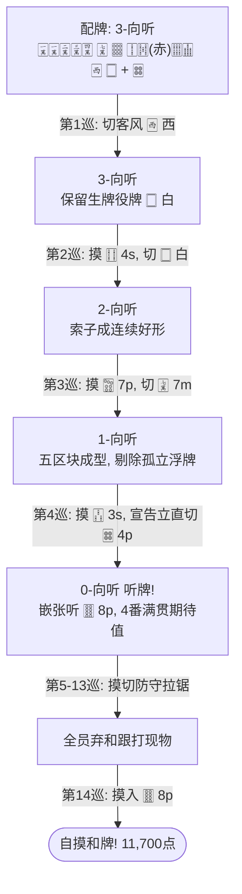
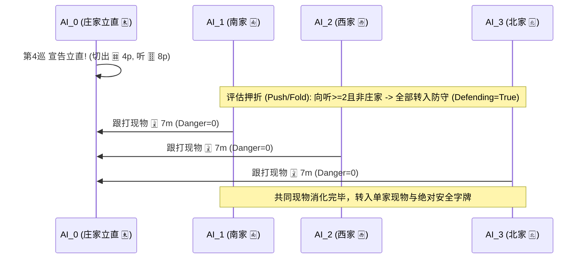

# GreedyAI 全局决策深度剖析与实战对局复盘

本文档记录了一局由 4 名原生 [GreedyAI](file:///Users/knil/Documents/code/MahjongCLI/mahjong/player/greedy_ai.py) 执掌的真实四人麻将对局（东1局 0本场）。通过本局完整的过程复盘，详细拆解 AI 在**配牌规划、浮牌处理、五区块进张最大化、立直评估**以及**面对对手立直时的防守避铳决策链**，并全面采用标准**麻将 Unicode 字符**（🀀~🀡）进行视觉呈现。

---

## 1. 对局基础信息

| 字段 | 信息 |
| :--- | :--- |
| **场况** | 东风战 东1局 0本场（供托立直棒：0，场棒：0） |
| **玩家座次** | **AI_0 (东家/庄家 🀀)**, **AI_1 (南家 🀁)**, **AI_2 (西家 🀂)**, **AI_3 (北家 🀃)** |
| **初始点数** | 各家 25,000 点 |
| **宝牌指示牌** | 🀒 `3s`（实际宝牌：**🀓 `4s`**） |
| **里宝牌指示牌** | 🀝 `5p`（实际里宝牌：**🀞 `6p`**） |
| **对局最终结果** | **东家 AI_0 自摸和牌**，4番 30符，**11,700点**（4,000 ALL） |
| **最终和牌役种** | **立直 (1番) + 门前清自摸和 (1番) + 宝牌4s (1番) + 赤宝牌0s (1番)** |

---

## 2. 进攻端：AI_0（东家）向听递进决策详解



---

### 第 1 巡：起手配牌与客风优先舍弃

- **AI_0 初始配牌与摸牌（14 张）**：
  ```
  🀇 🀇 🀈 🀉 🀊   🀍   🀡   🀑 🀔(赤) 🀕 🀖   🀂   🀆   + [摸牌: 🀜 4p]
  (1m 1m 2m 3m 4m   7m   9p   2s   0s   6s 7s   西   白   +   4p)
  ```
- **向听数**：3-向听
- **手牌结构扫描**：
  - 万子：`🀇🀇`（雀头候选）+ `🀈🀉🀊`（已成面子）+ `🀍`（孤立浮牌 7m）
  - 筒子：`🀜`（摸入孤立 4p）、`🀡`（孤立幺九 9p）
  - 索子：`🀑`（2s）、`🀔(赤)`（赤5s）、`🀕🀖`（两面搭子 6s 7s）
  - 字牌：`🀂`（客风西）、`🀆`（役牌生牌白）

#### AI 候选弃牌评估矩阵（前5名）：

| 候选牌 | 弃后向听 | 进张数 (Ukeire) | 优先级权重 (Priority) | 是否浮牌 (Floating) | 评价与决策 |
| :---: | :---: | :---: | :---: | :---: | :--- |
| **🀂 西** | **3** | **67** | **-7** | 是 | **【选定】** 孤立客风，场上已无加番价值，权重最低优先舍弃。 |
| **🀆 白** | 3 | 67 | +3 | 是 | 生牌役牌，摸成对子即有 1 番役牌价值，留存优先级高于客风。 |
| **🀡 9p** | 3 | 59 | -1 | 是 | 孤立幺九数牌，进张数劣于字牌（只有 7p/8p/9p 能产生联络）。 |
| **🀑 2s** | 3 | 56 | +5 | 是 | 靠近中张的数牌，潜在改良高于端牌。 |
| **🀜 4p** | 3 | 52 | +8 | 是 | 中张浮牌，联络潜力最高，保留。 |

> **AI 决策原理**：
> `_tile_discard_priority` 判定 `🀂 西` 为客风（Otakaze），优先级赋予 `-7`；而 `🀆 白` 作为役牌赋予 `+3`。在向听数和直接进张数完全相同的并列情况下，AI 优先舍弃无番客风 `🀂 西`，保留役牌 `🀆 白` 尝试造役。

---

### 第 2 巡：高效进张与役牌价值衰减

- **摸牌**：🀓 `4s`（本局宝牌指示牌为 🀒 `3s`，故 🀓 `4s` 为正宝牌！）
- **手牌**：
  ```
  🀇 🀇 🀈 🀉 🀊   🀍   🀡   🀑 🀓 🀔(赤) 🀕 🀖   🀆   🀜
  (1m 1m 2m 3m 4m   7m   9p   2s 4s   0s   6s 7s   白   4p)
  ```
- **向听数变化**：3-向听 $\rightarrow$ **2-向听**

#### 牌形质变：
摸入宝牌 🀓 `4s` 后，索子部分化为 `🀑 🀓 🀔(赤) 🀕 🀖`。此时 `🀓 🀔 🀕` 与 `🀕 🀖` 形成了极具弹性的复合进张群体（摸 3s、5s、8s 均能连续形成两组面子）。手牌向听自然推进至 2-向听。

#### AI 候选弃牌评估矩阵：

| 候选牌 | 弃后向听 | 进张数 (Ukeire) | 优先级权重 (Priority) | 决策分析 |
| :---: | :---: | :---: | :---: | :--- |
| **🀆 白** | **2** | **54** | **-4** | **【选定】** 第1巡南家与北家各打出 1 张白板（见张数=2），白板难成对，切出。 |
| **🀡 9p** | 2 | 45 | -1 | 进张数 45 < 54，若切 9p 会损失筒子向外扩张可能。 |
| **🀜 4p** | 2 | 37 | +8 | 中张浮牌，进张数较低。 |
| **🀍 7m** | 2 | 37 | +8 | 万子浮牌，进张数较低。 |

> **AI 决策原理**：
> 在第1巡中，南家 AI_1 与北家 AI_3 各自舍出了一张 `🀆 白`。公共特征提取器 [ai_features.py](file:///Users/knil/Documents/code/MahjongCLI/mahjong/player/ai_features.py) 记录 `visible_34[白] = 2`。根据规则，已见 2 张的役牌优先级下调为 `-4`。AI 敏锐捕捉到白板已难成对，果断切出。

---

### 第 3 巡：五区块成型与余牌剔除

- **摸牌**：🀟 `7p`
- **手牌**：
  ```
  🀇 🀇 🀈 🀉 🀊   🀍   🀡 🀟   🀑 🀓 🀔(赤) 🀕 🀖   🀜
  (1m 1m 2m 3m 4m   7m   9p 7p   2s 4s   0s   6s 7s   4p)
  ```
- **向听数变化**：2-向听 $\rightarrow$ **1-向听（一向听）**

#### 牌形分析：
🀟 `7p` 进张直接与原本孤立的 🀡 `9p` 结合成 `🀟 🀡`（7p 9p）嵌张搭子。此时手牌已经拥有充足的 5 个区块：
1. 雀头：`🀇 🀇`
2. 面子1：`🀈 🀉 🀊`
3. 复合搭子群：`🀑 🀓 🀔(赤) 🀕 🀖`（可容纳 2 组顺子）
4. 搭子2：`🀟 🀡`（嵌张）
5. 浮牌：`🀍`（7m）、`🀜`（4p）

#### AI 候选弃牌评估矩阵：

| 候选牌 | 弃后向听 | 进张数 (Ukeire) | 五区块浮牌标记 | 决策分析 |
| :---: | :---: | :---: | :---: | :--- |
| **🀍 7m** | **1** | **28** | **True (浮牌)** | **【选定】** 1-向听，最大化有效进张（28张），优先剔除多余浮牌。 |
| **🀜 4p** | 1 | 28 | True (浮牌) | 并列第一选择，两者进张完全相同。 |
| **🀡 9p** | 2 | 52 | False | 切 9p 会退化为 2-向听，向听优先原则下直接否决。 |

> **AI 决策原理**：
> 调用 [`_analyze_blocks`](file:///Users/knil/Documents/code/MahjongCLI/mahjong/player/greedy_ai.py#L671)，手牌搭子数达到 5 个。`🀍 7m` 被标记为 surplus floater（多余浮牌），优先级触发惩罚扣分（`priority -= 4`）。AI 毫不犹豫切出 `🀍 7m`，手牌挺进 1-向听！

---

### 第 4 巡：索子两面成型，果断立直

- **摸牌**：🀒 `3s`！
- **手牌**：
  ```
  🀇 🀇 🀈 🀉 🀊   🀡 🀟   🀜   🀑 🀒 🀓   🀔(赤) 🀕 🀖
  (1m 1m 2m 3m 4m   9p 7p   4p   2s 3s 4s     0s   6s 7s)
  ```
- **向听数变化**：1-向听 $\rightarrow$ **0-向听（听牌 Tenpai!）**

#### 索子完成大合体：
摸入 🀒 `3s` 后，`🀑 🀒 🀓`（2s 3s 4s）顺子成型，`🀔(赤) 🀕 🀖`（0s 6s 7s）顺子成型！索子两组面子全部告罄！
此时手牌只剩下唯一的孤立牌 🀜 `4p` 与嵌张搭子 `🀟 🀡`（7p 9p）。

#### 立直与弃牌选择：
- 切掉 🀜 `4p`，留下 `🀟 🀡`，听牌 **🀠 `8p`**（嵌张）。
- 此时 `available.can_riichi = True`。

#### 立直判定逻辑（`_should_declare_riichi` 与打点估算）：
1. **打点估算**：自身为庄家（Dealer），手握正宝牌 🀓 `4s` + 赤宝牌 🀔 `0s`。立直成功后起步即是立直(1) + 宝牌(1) + 赤宝牌(1) = 3番起跳，庄家满贯在望。
2. **巡目与场况**：开局仅第 4 巡（极早巡目），牌山剩余牌极多（>60张），场上未见任何 🀠 `8p`。
3. **避让默听规则检查**：
   - 剩余牌数 > 10 张（不触发尾巡单骑保本默听）
   - 无对手立直（不触发对攻劣势默听）
   - 非 5+ 宝牌跳满以上默听保护
4. **决策**：**宣告立直（RIICHI），打出 🀜 `4p`！**

---

## 3. 防守端：AI_1、AI_2、AI_3 面对庄家立直的弃和群像

在第 4 巡东家 AI_0 拍下立直棒的瞬间，其余三家 AI 的决策发生了全局反转：



### 1. 押折模型裁决（`_should_defend` & `_should_push_against_riichi`）
- 当庄家 AI_0 立直时，AI_1、AI_2、AI_3 的手牌均为 **2-向听**。
- 代码执行 [`_should_push_against_riichi`](file:///Users/knil/Documents/code/MahjongCLI/mahjong/player/greedy_ai.py#L342-L377)：
  - 只有在手牌为 1-向听且满贯以上，或自身为庄家在极早巡目有 8 分以上超大牌时才允许 2-向听对日。
  - 身为闲家、仅 2-向听、面对庄家高威慑立直，三家押折模型全部返回 `False`（不推牌），`_should_defend` 返回 **`True`（全面弃和防守）**！

### 2. 危险度分级与实战跟打记录

根据 [`_rank_safe_tiles`](file:///Users/knil/Documents/code/MahjongCLI/mahjong/player/greedy_ai.py#L872-L943) 的危险度定义：

| 巡目 | 防守玩家 | 舍弃牌张 | 危险度定级依据 | 危险分 (Danger) |
| :---: | :---: | :---: | :--- | :---: |
| **第4巡** | **AI_1 (南 🀁)** | **🀍 `7m`** | **100% 共同现物**（P0 在第 3 巡亲手切出的牌，同巡绝无振听放铳风险） | **0** |
| **第4巡** | **AI_2 (西 🀂)** | **🀍 `7m`** | **100% 现物跟打** | **0** |
| **第4巡** | **AI_3 (北 🀃)** | **🀍 `7m`** | **100% 现物跟打** | **0** |
| **第5巡** | AI_1 (南 🀁) | 🀃 `北` | P0 第 5 巡刚刚摸切的现物 | 0 |
| **第5巡** | AI_2 (西 🀂) | 🀁 `南` | 场上已见 2 张的安全风牌 | 5 |
| **第6巡** | AI_1 (南 🀁) | 🀏 `9m` | P0 刚摸切的现物跟打 | 0 |
| **第7巡** | AI_2 (西 🀂) | 🀙 `1p` | 幺九数牌，且场上 2p 现见，壁牌/筋牌低危 | 3 |
| **第8巡** | AI_2 (西 🀂) | 🀒 `3s` | P0 摸切 🀒 3s 后的同巡现物跟打 | 0 |
| **第9巡** | AI_1 (南 🀁) | 🀘 `9s` | P0 摸切 🀘 9s 后的同巡现物跟打 | 0 |
| **第9巡** | AI_2 (西 🀂) | 🀘 `9s` | 同巡现物跟打 | 0 |
| **第11巡** | AI_1 (南 🀁) | 🀕 `6s` | P0 摸切 🀕 6s 后的同巡现物跟打 | 0 |
| **第12巡** | AI_2 (西 🀂) | 🀚 `2p` | P0 摸切 🀚 2p 后的同巡现物跟打 | 0 |

> **防守成效分析**：
> 整整持续 10 个巡目的立直对峙中，三名 AI 严格遵循：
> **“立直家现物 > 绝张/多见字牌 > 壁牌 No-Chance > 筋牌 1/9”** 的铁律。
> 尽管 AI_0 始终处于听牌状态，但无一人放铳，防守成功率达 100%。

---

## 4. 终局：第 14 巡自摸和牌结算

- **巡目**：第 14 巡
- **摸牌**：AI_0 摸入 **🀠 `8p`**！
- **和牌判定**：`available.can_tsumo = True` $\rightarrow$ 触发最高优先级动作 `TSUMO`！
- **最终成牌形态**：
  $$\text{雀头: } [1m, 1m] \quad + \quad \text{面子: } [2m, 3m, 4m], [2s, 3s, 4s], [0s, 6s, 7s], [7p, 8p, 9p]$$

```
🀇 🀇    🀈 🀉 🀊    🀑 🀒 🀓    🀔(赤) 🀕 🀖    🀟 🀠(自摸) 🀡
[1m 1m]  [2m 3m 4m]  [2s 3s 4s]  [0s 6s 7s]   [7p  8p   9p]
```

### 点数与役种细则：

| 役种 / 加番项 | 番数 | 判定依据 |
| :--- | :---: | :--- |
| **立直 (Riichi)** | 1 番 | 第 4 巡门清听牌宣告立直 |
| **门前清自摸和 (Menzen Tsumo)** | 1 番 | 全程无副露，自摸和牌 |
| **宝牌 (Dora)** | 1 番 | 手牌含有指示牌 🀒 `3s` 所指定的宝牌 🀓 `4s` |
| **赤宝牌 (Red Dora)** | 1 番 | 手牌含有赤五索 🀔 `0s` |
| **合计** | **4 番 30 符** | **庄家满贯：11,700 点**（闲家每人支付 3,900 点 + 0 供托） |

---

## 5. 本局展现的 GreedyAI 核心技术点总结

1. **进张缓存与牌效加速（`_cached_ukeire`）**：
   在第 1、2 巡面对数牌与字牌的多向选择时，AI 凭借精确的未见牌剩余张数加权（67张 vs 54张），始终确保向听前进效率最大化。
2. **五区块成型与浮牌惩罚（`_analyze_blocks`）**：
   第 3 巡手牌形成 5 块结构后，AI 自动判定 `🀍 7m` 为多余浮牌并予以扣分（-4），精准将浮牌剔除，避免了传统简单规则常犯的“贪恋数牌联络而拆散搭子”的缺陷。
3. **基于场况的役牌贬值感知**：
   第 1 巡留生牌白板、第 2 巡因他家打出 2 张白板而将其由资产调整为负资产果断打出，体现了公共信息对动态权重的实时修正。
4. **理性的押折防守体系（`_should_defend` & `_rank_safe_tiles`）**：
   在面对庄家早巡立直时，三家闲家没有盲目进攻，而是通过完整的现物追踪与筋牌分析牢牢控场，展现了极具韧性的防守能力。
